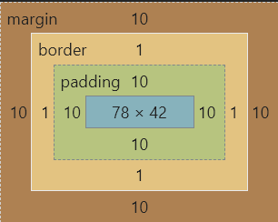
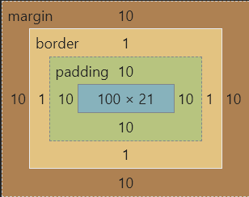

## offsetWidth

offsetWidth = 内容宽度 + 内边距 + 边框

- document.getElementById('div1').offsetWidth

```css
#div1 {
  width: 100px;
  padding: 10px;
  border: 1px solid #ccc;
  margin: 10px;
  /* box-sizing: border-box */ // 有则offsetwidth就是Width
}
```




