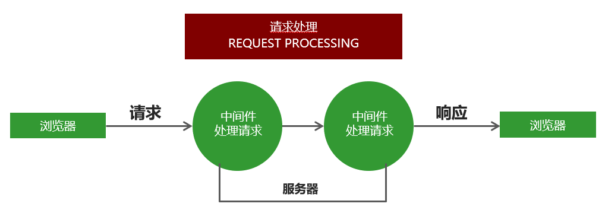
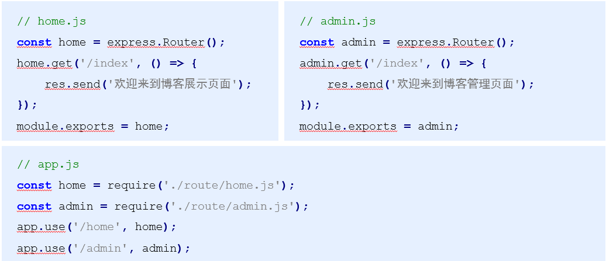

## 1 介绍

Express 是一个基于 Node 平台的 web 应用开发框架，它提供了一系列的强大特性，帮助你创建各种 Web 应用。我们可以使用 npm install express 命令进行下载。

## 2 基本代码演示

```javascript
// 引入express框架
const express = require('express')
//创建网站服务器
const app = express()
app.get('/', (req, res) => {
  // send()
  // 1. send方法内部会检测响应内容的类型
  // 2. send方法会自动设置http状态码
  // 3. send方法会帮我们自动设置响应的内容类型及编码
  res.send('Hello. Express')
})

// 监听端口
app.listen(3000)
console.log('网站服务器启动成功')
```

## 3 中间件

### 3.1 中间件基础

中间件就是一堆方法，可以接收客户端发来的请求、可以对请求做出响应，也可以将请求继续交给下一个中间件继续处理。 理解为一个水路的不同的水阀


- 中间件主要由两部分构成，中间件方法以及请求处理函数。
- 中间件方法由 Express 提供，负责拦截请求，请求处理函数由开发人员提供，负责处理请求。

```javascript
app.get('请求路径', '处理函数') // 接收并处理get请求
app.post('请求路径', '处理函数') // 接收并处理post请求
```

可以针对同一个请求设置多个中间件，对同一个请求进行多次处理。
默认情况下，请求从上到下依次匹配中间件，一旦匹配成功，终止匹配。
可以调用 next 方法将请求的控制权交给下一个中间件，直到遇到结束请求的中间件。

```javascript
app.get('/request', (req, res, next) => {
  req.name = '张三'
  next()
})
app.get('/request', (req, res) => {
  res.send(req.name)
})
```

### 3.2 app.use 中间件用法

app.use 匹配所有的请求方式，可以直接传入请求处理函数，代表接收所有的请求。

```javascript
app.use((req, res, next) => {
  console.log(req.url)
  next()
})
```

app.use 第一个参数也可以传入请求地址，代表不论什么请求方式，只要是这个请求地址就接收这个请求。

```javascript
app.use('/admin', (req, res, next) => {
  console.log(req.url)
  next()
})
```

### 3.3 中间件应用

- 1、路由保护，客户端在访问需要登录的页面时，可以先使用中间件判断用户登录状态，用户如果未登录，则拦截请求，直接响应，禁止用户进入需要登录的页面。
- 2、网站维护公告，在所有路由的最上面定义接收所有请求的中间件，直接为客户端做出响应，网站正在维护中。
- 3、自定义 404 页面

```javascript
//网站公告
app.use((req, res, next) => {
  res.send('当前的网站正在维护...')
})

app.use('/admin', (req, res, next) => {
  //用户登录
  let isLogin = true
  //判断
  if (isLogin) {
    //让请求继续执行下去
    next()
  } else {
    //如果用户没有登录 直接对客户端做出响应
    res.send('您还没有登录 不能访问/admin这个页面')
  }
})

app.get('/admin', (req, res) => {
  res.send('您已经登录， 可以访问当前页面')
})

app.use((req, res, next) => {
  // 为客户端响应404状态码以及提示信息
  res.status(404).send('当前访问的页面是不存在的')
})
```

### 3.4 错误处理中间件

在程序执行的过程中，不可避免的会出现一些无法预料的错误，比如文件读取失败，数据库连接失败。
错误处理中间件是一个集中处理错误的地方。

```javascript
//创建一个错误
app.get('/index', (req, res, next) => {
  //throw new Error('程序发生了未知的错误');
  //res.send('程序正常进行')
  fs.readFile('./01.js', 'utf8', (err, result) => {
    if (err != null) {
      next(err)
    } else {
      res.send(result)
    }
  })
})

//错误处理的中间件
app.use((err, req, res, next) => {
  res.status(500).send(err.message)
})
```

### 3.5 捕获错误

在 node.js 中，异步 API 的错误信息都是通过回调函数获取的，支持 Promise 对象的异步 API 发生错误可以通过 catch 方法捕获。
异步函数执行如果发生错误要如何捕获错误呢？
try catch 可以捕获异步函数以及其他同步代码在执行过程中发生的错误，但是不能捕获其他类型的 API 发生的错误。

```javascript
app.get('/index', async (req, res, next) => {
  try {
    await readFile('./aaa.js')
  } catch (ex) {
    next(ex)
  }
})

// 错误处理中间
app.use((err, req, res, next) => {
  res.status(500).send(err.message)
})
```

## 4 Express 请求处理

### 4.1 构建模块化路由

```javascript
const express = require('express')
// 创建路由对象
const home = express.Router()
// 将路由和请求路径进行匹配
app.use('/home', home)
// 在home路由下继续创建路由
home.get('/index', () => {
  //  /home/index
  res.send('欢迎来到博客展示页面')
})
```



### 4.2 GET 参数的获取

Express 框架中使用 req.query 即可获取 GET 参数，框架内部会将 GET 参数转换为对象并返回。

```javascript
// 接收地址栏中问号后面的参数
// 例如: http://localhost:3000/?name=zhangsan&age=30
app.get('/', (req, res) => {
  console.log(req.query) // {"name": "zhangsan", "age": "30"}
})
```

### 4.3 POST 参数的获取

Express 中接收 post 请求参数需要借助第三方包 body-parser 参数 req.body。

```javascript
// 引入body-parser模块
const bodyParser = require('body-parser')
// 配置body-parser模块
// extended: false 方法内部使用querystring模块处理请求参数的格式
// extended: true 方法内部使用第三方模块qs处理请求参数的格式
app.use(bodyParser.urlencoded({ extended: false }))
// 接收请求
app.post('/add', (req, res) => {
  // 接收请求参数
  console.log(req.body)
})
```

### 4.4 Express 路由参数

应用于 get 请求，对传递的请求参数的要求

```javascript
app.get('/find/:id/:name', (req, res) => {
  console.log(req.params) // {id: 123}
})
```

localhost:3000/find/123/yky //当使用路由参数时，就不用 ？和&

### 4.5 静态资源的处理

通过 Express 内置的 express.static 可以方便地托管静态文件，例如 img、CSS、JavaScript 文件等。

```javascript
app.use('/static', express.static(path.join(__dirname, 'public')))
```

http://localhost:3000/css/style.css
http://localhost:3000/js/app.js

直接这种形式访问

## 5 模板引擎 express-art-template

### 5.1 基础

- 为了使 art-template 模板引擎能够更好的和 Express 框架配合，模板引擎官方在原 art-template 模板引擎的基础上封装了 express-art-template。
- 使用 npm install art-template express-art-template 命令进行安装。

```javascript
// 当渲染后缀为art的模板时 使用express-art-template
app.engine('art', require('express-art-template'))
// 设置模板存放目录
app.set('views', path.join(__dirname, 'views'))
// 渲染模板时不写后缀 默认拼接art后缀
app.set('view engine', 'art')
app.get('/', (req, res) => {
  // 渲染模板
  res.render('index') //使用render
})
```

### 5.2 app.lcoals 对象

将变量设置到 app.locals 对象下面，这个数据在所有的模板中都可以获取到。

```javascript
//当中的参数，在其他请求地址有的话，就被被用的
app.locals.users = [
  {
    name: 'zhangsan',
    age: 20,
  },
  {
    name: '李四',
    age: 30,
  },
]

app.get('/index', (req, res) => {
  res.render('index', {
    msg: '首页',
  })
})

app.get('/list', (req, res) => {
  res.render('list', {
    msg: '列表页',
  })
})
```
