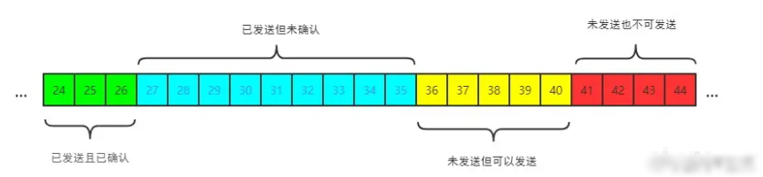
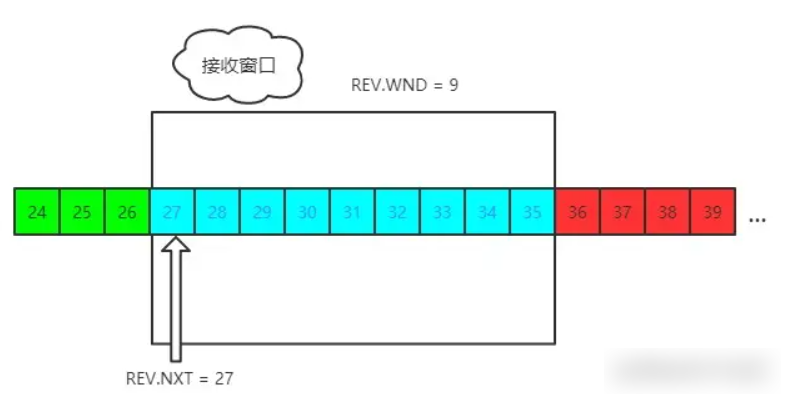

## TCP/UDP 的区别

- 连接方面
  - tcp 面向连接，udp 不需要连接
  - tcp 需要三次握手四次挥手请求连接
- 可靠性 - tcp 是可靠传输，一旦传输过程中丢包的话就会进行重传 - udp 是不可靠传输，但是会尽最大的努力交付
- 工作效率
  - udp 实时性高，比 TCP 工作效率要高
  - 因为不需要建立连接，更不需要复杂的握手挥手以及复杂的算法，也没有重传的机制
- 是否支持多对多 - tcp 是点对点 - UDP 支持一对一，一对多，多对多
- 首部大小 - tcp 首部占 20 字节 - udp 首部占 8 个字节

## TCP/UDP 应用

|         TCP         |              UDP               |
| :-----------------: | :----------------------------: |
|    SMTP 电子邮件    |          DNS 域名转换          |
| TELNET 远程终端接入 |         TFTP 文件传输          |
|     HTTP 万维网     |         SNMP 网络管理          |
|    FTP 文件传输     | QUIC 可靠的应用层协议类似 http |

## TCP 流量控制

对于发送端和接收端而言，TCP 需要把发送的数据放在发送缓存区，将接受的数据放在接收的缓存区。

而流量控制就是通过接受缓存区的大小，控制发送端的发送。如果对方的接受缓存区满了，就不能再继续发送了。

### TCP 滑动窗口

TCP 滑动窗口分成两种：发送窗口和接收窗口

- 发送窗口

其中包含四大部分:

    - 已发送且已确认
    - 已发送但未确认
    - 未发送但可以发送
    - 未发送也不可以发送

- 接受窗口

- 流量控制过程

通过 TCP 来连接发送数据，如果发送方发送的数据很慢，容易导致资源的浪费；如果发送方发送的数据过快，接受方来不及接受数据会造成数据的丢失。流量控制就是指在接收方能够接受的范围内，合理而又快速的发送数据。

## 拥塞控制

**拥塞控制**是指防止过多的数据注入网络中，这样可以使网络中路由器或者链路不致过载。现在通信线路的传输质量一般都很好，因传输出现差错丢弃分组的概率很小。因此，判断网络拥塞的依据就是出现了**超时**。

​ TCP 进行拥塞控制常用的算法有四种：**慢启动**、**拥塞避免**、**快重传**、**快恢复**。

### 慢启动

TCP 为发送方维持一个拥塞窗口（cwnd）。拥塞窗口是发送方使用流量控制，接收方声明的接受窗口是接收方使用的流量控制。发送方的发送窗口大小等于这两个窗口中的最小值。

**拥塞窗口**的值跟 SMSS 有关，SMSS 为发送的**最大报文段长度**。旧的规定是**拥塞窗口**的初始值为 1 至 2 个 SMSS，RFC 5681 规定**拥塞窗口**的初始值不超过 2 至 4 个 SMSS。

**慢启动**算法规定：拥塞窗口初始化后，每收到一个对新报文的确认，拥塞窗口就加一个 SMSS 的大小。拥塞窗口以字节为单位，但是慢启动以 SMSS 大小为单位增加。按照慢启动算法，经过一轮传输，拥塞窗口就增大一倍，这是一种**指数增长**的关系。

### 拥塞避免

**慢启动**算法除了维持**拥塞窗口**cwnd 变量之外，还维持另一个变量**慢启动门限**ssthresh。当 cwnd 以指数增长的形式增长到大于或等于 ssthresh 时，就不再采用**慢启动**算法，而是采用**拥塞避免**算法来进行拥塞控制。

**拥塞避免**算法规定：每次收到一个确认时将 cwnd 增加 1/cwnd 个 SMSS。即不再是像慢启动算法那样经过一轮传输 cwnd 翻倍了，而是经过一轮传输增加一个 SMSS。这是一种**加性增长**的关系。
  当拥塞发生时（超时或收到重复确认），cwnd 被设置为 1 个 SMSS。ssthresh 被设置为当前窗口大小的一半，但最少为 2 个报文段。

### 快重传

如果个别报文段在网络中丢失，网络并没有发生拥塞，这种情况下发送方收不到确认报文，在超时之后会重传该报文。发送方误以为网络发生拥塞，错误的启动慢开始算法，降低了传输效率。
  采用**快重传**算法可以让发送方尽早知道个别报文段的丢失。**快重传**算法要求接收方不要延时发送确认，即使收到失序的报文段也要立刻发送对已收到报文的重复确认。

例如：接收方收到 M1 之后发送对 M1 的确认报文，M2 报文丢失，之后接收方收到 M3、M4、M5 时每次都发送对 M1 报文的重复确认。**快重传**算法规定当收到**三次重复确认**后，发送方就认为 M2 报文段丢失，立即重传 M2 报文段，而不用等待超时时再重传，这样可以避免发送方误认为网络发生拥塞。使用快重传可以使整个网络的吞吐量提高约 20%。

### 快恢复

在**快重传**算法执行后，发送方知道只是丢失个别报文，而不是网络发生拥塞。之后并不会执行**慢启动**算法，而是执行**快恢复**算法：调整门限值 ssthresh = cwnd/2，同时设置 cwnd = ssthresh + 3 SMSS。这种设置门限值为当前拥塞窗口的一半，同时根据门限值调整拥塞窗口的形式称为**乘法减小**。
  为什么要设置拥塞窗口的值为门限值加 3 个报文段，而不是直接等于门限值？这是因为发送方收到三个确认报文，就认为有三个分组已经离开网络到达接收方的缓存，这三个确认报文不再占用网络资源，可以适当增大拥塞窗口的大小。
