## webpack

### 1. 打包过程

方式一命令行工具：

`webpack --entry ./src/main.js --output-path ./bulid`

方式二配置文件：`webpack.config.js`

```javascript
const path = require('path')

module.exports = {
  entry: './src/main.js',
  output: {
    filename: 'build.js',
    path: path.resolve(__dirname, 'dist'),
  },
}
```

如果配置文件名不是`webpack.config.js`

解决方案：在配置文件种修改 build 指令的配置参数

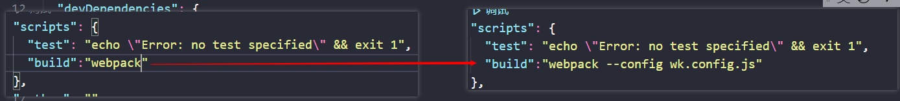

### 2.webpack 依赖关系图

- webpack 到底是如何对我们的项目进行打包的呢？
  - 事实上 webpack 处理应用程序时，根据命令或已配置的文件找到入口
  - 入口开始，生成一个 **依赖关系图**，这个依赖关系图会包含应用程序中所需的所有模块（js，css，图片，字体）
  - 遍历图结构，打包一个个模块（根据文件的不同使用不同的 loader 来解析）
- 上述的例子：
  - 例子一：安装了某个第三方库`axios`，但是并没有使用，所以打包不会带进去，打包后总体积不会增大。
  - 例子二：项目中创建的文件，没有被引用，最后打包不会在依赖图上，所以体积也不会增大。
  - 例子三：假如有个 js 文件里面有函数，js 确实被引用了，但是函数未被执行，函数也不会被打包。
    - 涉及到 tree shaking

### 3.代码编写案例

- 写了个 css，导入到文件，最后把它打包，最后会报错，原因是缺少加载 css 的 loader
- loader 是什么呢？
  - 用于对模块的源代码进行替换
  - css 文件也可以看成是一个模块，通过 **import**来加载这个模块
  - 在加载这个模块时，webpack 其实并不知道如何对其进行加载，我们必须制定对应的 loader 来完成这个功能
- 那么什么样的 loader 可以加载 css 呢？

  - 这个常用的 loader 最常用的是 css-loader
  - 安装：`npm install css-loader -D`

- css-loader 的三种使用方案：

  - 内联

  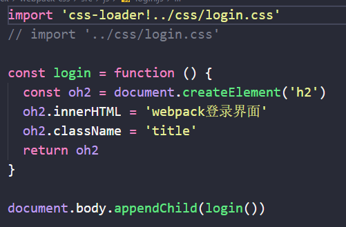

  - CLI 方式（webpack5 中不再使用）
  - 配置方式

- 有`css-loader`表示正常处理解析了 css 文件，但是解析之后的 css 文件没有插入到页面上。

- 想要插入 style，就需要使用`style-loader`

  - `npm i style-loader -D`
  - use: ["style-loader"]
  - style-loader 的原理就是在 document.createElement(style)创建了个样式表

- 注意：**webpack 处理 loader 的时候是从下往上的，从右往左的**

### 4.loader 配置方法

- module.rules 的配置如下：

- rules 属性对应的值是一个数组 **[Rule]**

- 数组中存放的时 一个个的 Rule，Rule 是一个对象，对象中可以设置多个属性：

  - test 属性：用于对 resource（资源）进行匹配，通常设置成正则表达式

  - use 属性：对应的值是一个数组：

    [UseEntry]

    ，也是一个对象，有两个 key

    - loader：指明要用哪些 loader
    - options：可选属性，值可以使字符串或对象，值会被传入到 loader 中

  - `use:["css-loader"]`相当于键值对的写法

```javascript
const path = require('path')

module.exports = {
  entry: './src/main.js',
  output: {
    filename: 'build.js',
    path: path.resolve(__dirname, 'dist'),
  },
  module: {
    rules: [
      /* {
        test: //.css$/, // 一般就是一个正则表达式，用于匹配我们所需要的文件类型
        use: [
          {
            loader: 'css-loader',
          },
        ],
      }, */
      /* {
        test: /\.css$/,
        loader: 'css-loader',
      }, */
      {
        test: /\.css$/,
        use: ['style-loader', 'css-loader'],
      },
    ],
  },
}
```

### 5.如何处理 scss 文件

安装 node-sass, 用于 把 scss 转化成 css（-D）

还有就是 sass-loader（-D）

配置 rule

```javascript
{
        test: /\.scss$/,
        use: ['style-loader', 'css-loader', 'sass-loader'],// 从右到左，从下到上
      },
```

### 6.postcss

#### 6.1 browserslist

用来判断要兼容的浏览器有哪些，可以单独的 写配置文件，也可以放在 packjson 中。可以通过调用

`npx browserslist`,来查看需要兼容的浏览器

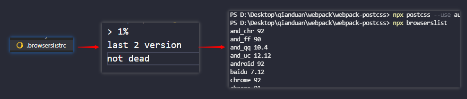

#### 6.2 postcss **工具**

- 什么是 PostCss？
  - PostCss 是通过**JavaScript**来**转换样式**的工具
  - 这个工具可以帮助我们进行 CSS 的转换和适配，比如自动添加浏览器前缀，css 样式重置
    - 需要添加前缀的样式网站是：`autoprefixer.github.io`
  - 实现这些功能，都需要借助于 PostCSS 对应的插件
- 如何使用 PostCSS 呢？主要就是两个步骤：
  - 先查找 PostCSS 在构建工具的扩展，比如 webpack 中的 postcss-loader；
  - 选择可以添加你需要的 PostCSS 相关插件

#### 6.3 命令行使用 postcss

- 我们可以直接在终端中使用 PostCSS，只需要单独安装一个工具

  ```
  postcss-cli
  ```

  - `npm i postcss -D`
  - `npm i postcss-cli -D` 目的是为了能在命令行中使用 PostCSS

- 举个栗子：现在有个 css 文件里面有些样式，但是这些样式是需要加上浏览器前缀的

  - 现在这些样式是不行的，需要进行处理才能正常运行
  - `npx postcss -o result.css ./src/css/test.css`（wrong）

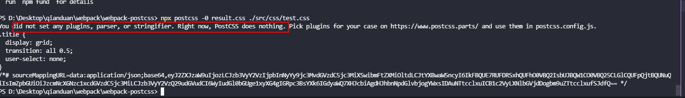

postcss 本身是没有任何作用的，你要给他配上插件，他才能起作用，类似于多功能螺丝刀套装中的柄，要有头才能工作。

想要自动添加前缀需要安装什么插件呢？

- `npm i autoprefixer -D` - 然后再执行的时候也需要告诉这次你要使用的插件 - `npx postcss --use autoprefixer -o result.css ./src/css/test.css`

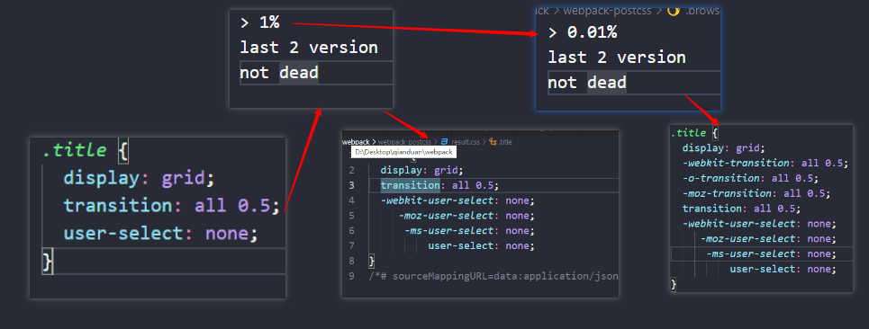

#### 6.4 在 webpack 中使用 postcss

- 大致流程就是我们需要把自己写的 css 通过 postcss 转换成有前缀的 result.css

- 然后再交给 css-loader 处理，渲染

- 首先需要安装

postcss-loader

- `npm i postcss-loader -D`

- 然后需要在 css-loader 之前通过 postcss-loader 处理

  - 但要注意的是要使用对应的插件，上面也提到过

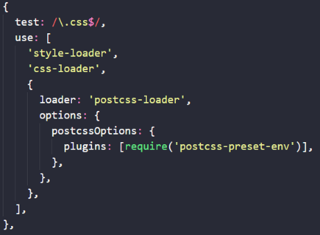

#### 6.5 `postcss-preset-env`的使用

这个相当于螺丝刀头的整个的套装，它同样包括了`autoprefixer`

- 上面介绍了 **autoprefixer**，但是很多项目中使用更多的是 **postcss-preset-env**

- 他的作用也是转换 **现代 css 特性**，让这个 css 可以被大多数浏览器识别

- 举个栗子：

  - 我们一般写 16 进制颜色的时候写 6 位：如 `#123456`, 代表着 rgb
  - 但是我们写成 8 位 `#12345678` ,代表着 rgba，后面两个代表透明度
  - 但这个 8 位最新的浏览器确实可以解析，但是旧浏览器无法解析，而且上面使用的 **autoprefixer**也不会帮我们转换
  - 那怎么办? 答案就是使用 **postcss-preset-env**

- 使用步骤：

  - 安装： `npm i postcss-preset-env -D`

  - 在 postcss-loader 中使用该插件

    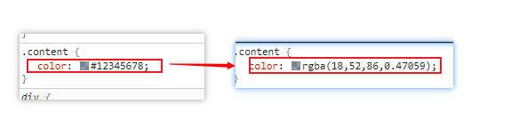

#### 6.6 配置优化

- 在普通 css 中这样处理需要写一大推代码，项目中又有`scss`有需要写一遍相同的代码，有没有办法优化？
- 将整个代码块直接改成像`css-loader`一样，写个字符串
- 把相关的插件依赖写到`postcss.config.js`里面，名字一定是要这个，不然无法读取

```javascript
module.exports = {
    pluginL [
    	require('postcss-preset-env')
    ]
}
```

#### 6.7`css`使用@import 注意事项

- 有些场景是在一个样式中通过 **@import**引入另外一个 css 文件

- 这种情况就不会被 **postcss-loader**处理，需要为 **css-loader**添加 **`importLoaders`**属性

- 设置成 1 的的意思是，再遇到有引入的 css 文件，就会对这个文件进行往回走一步，处理再回来。

```javascript
{
	loader: "css-loader",
    options: {
		importLoaders: 1
    }
}
```

### 7.处理其他资源

#### 7.1 file-loader

- 要处理一些图片格式文件，我门也要有对应的 loader： `file-loader`

- `file-loader`的作用就是，我们用**import/require（）** 方式引入一个文件资源的时候，会把它放到我们输出的文件夹

- 安装： `npm i file-loader -D`

  - 使用 require 导入图片，此时如果不配置 esModule： false， 则需要。default 导出

  - 也可以在配置当中设置 esModule: false

  - 采用 import xxx from 图片资源， 此时可以直接使用 xxxx

  ```javascript
  // @ts-ignore
  import imgSrc from '../img/02.jpg'

  function packImg() {
    const oEle = document.createElement('div')
    const oImg = document.createElement('img')
    oEle.className = 'test'
    // @ts-ignore
    //oImg.src = require('../img/02.jpg').default  // 返回一个对象，所以要加defalut
    // oImg.src = require('../img/02.jpg')
    oImg.src = imgSrc
    oEle.appendChild(oImg)
    return oEle
  }

  document.body.appendChild(packImg())
  ```

  `webpack.config.js`

  ```javascript
  {
          test: /\.(png|svg|gif|jpe?g)$/,
          use: [
            {
              loader: 'file-loader',
              /* options: {
                esModule: false, // 不转为esModule
              }, */
            },
          ],
        },
  ```

##### 7.1.2 图片资源重命名和对应目录

**但是考虑一个问题，打包之后的图片资源名称是经 md4 加密后的哈希值，不方便 和原资源名称对应起来，想要对应起来，怎么做？**

```javascript
{
    test:/\.(png|jpg|jpeg|gif|svg)$/ ,
    use: [
      {
        loader: 'file-loader',
        options: {
          name: "[name].[hash:6].[ext]",
          outputPath: 'img'
        }
      }
    ]
}
```

```javascript
//通过占位符
//[ext] : 占位符
//[name] : 文件名
//[hash] : 文件内容
//[hash:<length>] : 选取 hash 的前几位</length>
```

#### 7.2 url-loader

url-loader 和 file-loader 工作方式相似，但是可以把较小的文件转化成 base64 的 URL

安装： `npm i -url-loader -D`

配置：

- 不会像 **file-loader**一样去生成图片，而是转换成 **base-64**直接嵌入到 js 文件当中

```javascript
{
    test:/\.(png|jpg|jpeg|gif|svg)$/ ,
    use: [
      {
        loader: 'url-loader',
        options: {
          name: "[name].[hash:6].[ext]",
          outputPath: "img"
        }
      }
    ]
  }
```

##### 7.2.1 url-loader 的问题

- 一般那适合小文件，这样也减少了网页请求的次数
- 如果是大文件，把 base64 嵌入进去就会让文件很大
- 首次加载会消耗更多的时间去加载这个 js 文件，造成白屏时间长

解决方法就是小文件转，大文件还是使用 file-loader，url-loader 是可以调用 file-loader 的；使用一个 limit 配置，作为文件大小的分界线

```javascript
	{
        test: /\.(png|svg|gif|jpe?g)$/,
        use: [
          {
            loader: 'url-loader',
            options: {
              //esModule: false, // 不转为esModule
              name: '[name].[hash:6].[ext]',
              limit: 25 * 1024,
              outputPath: 'img',
            },
          },
        ],
      },
```

#### 7.3 asset(webpack5 新特性)

在 webpack5 之前，会使用到 **raw-loader**、 **url-loader**、 **file-loader**。但是 webpack5 出来之后，我们可以直接使用资源模块类型（asset module type），来替代上面这些 loader

**资源模块类型（asset module type）**，通过添加 4 种薪的模块类型，来替换所有这些 loader：

- **asset/resource** 发送单独的文件并导出 URL。之前对应的是 **file-loader**
- **asset/inline** 导出一个资源的 data URI。之前通过使用 **url-loader**实现
- **asset/source**导出资源的源代码。之前对应 **raw-loader**
- **asset**在导出一个 data URI 和发送一个单独的文件之间自动选择。之前通过 **url-loader**，并且配置资源体积限制实现。

##### 7.3.1 使用 asset module type

无需安装，webpack 内置

配置代码：

```javascript
{
    test:/\.(png|jpg|jpeg|gif|svg)$/ ,
    type: "asset/resource"
  }
```

指定目录的存放方式

**方式一：**

```javascript
  output: {
    filename: "boundle.js",
    path: path.resolve(__dirname, "./build"),
    assetModuleFilename: "img/[name].[hash:6][ext]"  // 和file-loader不一样的地方，扩展名之前少一个.，模块帮我们加过了
  },
```

**方式二（在 generator 属性中设置）:**

```javascript
 {
    test:/\.(png|jpg|jpeg|gif|svg)$/ ,
    type: "asset/resource",
    generator: {
      filename: "img/[name].[hash:6][ext]"
    }
  },
```

大图片小图片采用不同的 type

- 就是把大图片带走打包，小图片就转换为 base64 嵌入行内；
- 直接把 **type 类型设置为 asset**
- 设置 parser 属性中的 maxSize

```javascript
  {
    test:/\.(png|jpg|jpeg|gif|svg)$/ ,
    type: "asset",  // 二选一打包
    generator: {
      filename: "img/[name].[hash:6][ext]"
    },
    parser: {
      dataUrlCondition: {
        maxSize: 100 *1024
      }
    }
  },
```

#### 7.4 加载字体

很多场景下都会使用到特殊的字体或者字体图标，就会引入很多字体相关的文件，这些文件的处理方式都是一样的。

在 webpack5 之前也是通过 file-loader 来处理，但是在 webpack5 中就完全没必要了。

代码配置

```javascript
 {
    test: /\.ttf|eot|woff2?$/i,
    type: "asset/resource",
    generator: {
      filename: "font/[name].[hash:6][ext]"
    }
  }
```

### 8 plugin

#### 8.1 plugin 和 loader 的区别

- loader 是用于·特定模块类型的转换，对那些资源经行预处理
- plugin 用于执行更加广泛的任务，比如打包优化，资源管理，环境变量注入。在 webpack 运行过程中生命周期中会广播很多事件，plugin 通过监听这些事件，然后调用 webpack 提供的 api 来改变输出结果
- 还有就是配置方法不一样，loader 实在 module.rules 中配置，不同类型资源（test）可能会用到多个 loader（use）。plugin 是在 plugins 中配置的，类型为数组，每一项都是 plugin 的实例，传递参数通过构造函数传入。

举例说明：

- css 文件需要用到 css-loader 去加载

- 但是多个 css 文件合并就需要用到插件

  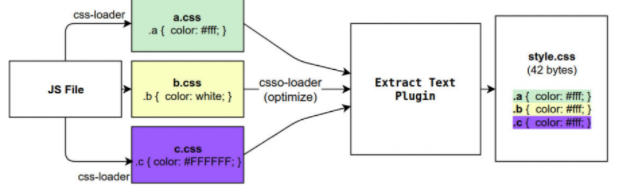

`plugin` 例子

- 不经过特殊处理的话，每次打包后的 build 文件夹，同名称的文件会被覆盖，但是多余文件不会被删除，
- 想要它删除多余文件，也就是重新生成新的 build 文件夹，该怎么做？

安装 `npm i clean-webpack-plugin -D`

导入 `const { CleanWebpackPlugin } = require('clean-webpack-plugin')`

配置代码

```javascript
plugins: [new CleanWebpackPlugin()]
```

#### 8.2 HtmlWebpackPlugin

在 dist 中自动生成 html 文件

安装： `npm i html-webpack-plugin -D`

配置代码

```javascript
plugins: [
  new CleanWebpackPlugin(),
  new HtmlWebpackPlugin({
    title: 'coderqmj webpcak app',
  }),
]
```

- 这样做的话就可以打包之后在 build 生成 HTML 文件，根据模板引擎生成
- 但是某些特除场景下提供的模板引擎无法满足需求，如 vue 中是需要把 组件挂载到`<div id="app"></div>`中的
- 所以我们还需要自定义模板引擎

##### 8.2.1 自定义模板引擎

首先需要在根目录下创建 public 目录，在里面创建 index.html

配置代码

```javascript
plugins: [
  new HtmlWebpackPlugin({
    title: 'coderqmj webpcak app',
    template: './public/index.html',
  }),
]
```

#### 8.3 定义全局常量 DefinePlugin

这是一个内置插件，无需安装直接引入

配置代码

```javascript
// 导入
const { DefinePlugin } = require('webpack');
...
plugins: [
    new DefinePlugin({
       BASE_URL: '"./"'
    })
]
```

#### 8.4 CopyWebpckPlugin

安装 `npm i copy-webpack-plugin -D`

配置

- 这样做技能复制 public 下面的文件，也能忽略复制对应的文件

- 需要注意的是，忽略配置的形式是 `**/文件名`

```javascript
// 导入
const CopyWebpackPlugin = require('copy-webpack-plugin');
...
new CopyWebpackPlugin({
  patterns: [
    {
      from: "public", // 从这个地方复制，to是默认在build文件夹下面的
      globOptions: {
        ignore: [
          "**/index.html"
        ]
      }
    }
  ]
})
```

### 9 Babel

#### 9.1 简单介绍

**为什么需要 babel？**

- 在编码中，很少接触 babel，但是对于前端开发来说，这是不可获取的
- 我们想要在项目中使用 ES6，TS，开发 Vue 项目，都是离不开 babel 转换的
- 所以，学习 babel 对于我们理解代码从编写到上限的转变过程至关重要

**那 babel 到底是什么？**

- babel 是一个工具链，主要用于旧浏览器或者缓解中将 ES2015+代码转换为向后兼容版本的 JS
- 包括语法转换、源代码转换、Polyfill 实现目标缓解缺少的功能等

#### 9.2 Babel 的使用

原文件

```javascript
// 源文件
const message = 'Hello World'

const foo = (info) => {
  console.log(info)
}

foo(message)
```

安装： `npm i @babel/core -D`

在命令行使用 babel： `npm i @babel/cli -D`

babel 输出： `npx babel src/index.js --out-dir result`

以上操作的结果是不能转换箭头函数的，跟 postcss 一样，babel 只是螺丝柄，他需要各种各样的螺丝头（插件）。

箭头函数转换插件： `npm i @babel/plugin-transform-arrow-functions -D`

块级作用域转换插件： `npm i @babel/plugin-transform-block-scoping -D`

使用命令上：`npx babel src/index.js --out-dir result --plugins=@babel/plugin-transform-arrow-functions,@babel/plugin-transform-block-scoping`

9.2.1 babel 的预设（preset-env）

那么问题来了，ES6 这么多需要转换的，难道都需要一个个写吗？

当然不是，跟 postcss 一样，会有一个预设，包含了所有的插件

- **安装预设** ： `npm i @babel/preset-env -D`

- **使用预设** ： `npx babel src --out-dir result --presets=@babel/preset-env`

```javascript
'use strict'

var message = 'Hello World'

var foo = function foo(info) {
  console.log(info)
}

foo(message)
```

#### 9.3 babel-loader

安装：`npm install -D babel-loader @babel/core @babel/preset-env`

配置：

```javascript
	{
        test: /\.js$/,
        use: ['babel-loader'],
      },
```

单独的`babel.config.js`

```javascript
module.exports = {
  presets: [['@babel/preset-env']],
}
```

#### 9.4 polyfill

帮助我们更好的使用 JavaScript，我们使用了一些特性如，promise，generator，以及实例 Array.prototype.includes 等，但是某些浏览器不认识这些特性，就会报错，这时候我们使用 polyfill 来填充打补丁，就会包含该特性了。在 webpack4 中会把这些都直接加上，但是 webpack5 中这些根据自己的需求加上。

[zloirock/core-js: Standard Library (github.com)](https://github.com/zloirock/core-js#babelpolyfill)

在 webpack5 中，安装两个包

`npm i core-js regenerator-runtime`

```javascript
module.exports = {
  presets: [
    [
      '@babel/preset-env',
      {
        targets: 'defaults',
        // 默认false， 表示不对当前的js处理进行polyfill填充
        // usage 依据用户源代码中的所使用的语法进行填充
        // entry  根据borwserslist来，看浏览器要求来填充
        useBuiltIns: 'entry',
        corejs: 3,
      },
    ],
  ],
}
```

使用 entry 在入口文件那要加上

`import 'core-js/stable'`
`import 'regenerator-runtime/runtime'`

```javascript
import 'core-js/stable'
import 'regenerator-runtime/runtime'

const title = 'yky'

const foo = (title) => {
  console.log(title)
}

foo(title)

let p = new Promise((resolve, reject) => {
  console.log('aaa')
})

console.log(p)
```

#### 9.5 babel 的原理

babel 分成三部分

- 解析：将代码转化成 AST（抽象语法树）

  - 词法分析：将代码（字符串）分割成 token 流，即语法单元成的数组
  - 语法分析： 分析 token 流（上面生成的数组）并生成 AST

- 转换： 访问 AST 的节点进行转换变换操作，生产新的 AST

- 生成：以新的 AST 为基础生成代码

  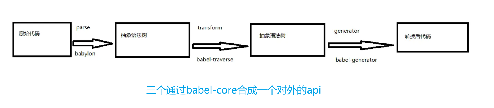

**先看下 JS 执行过程** ：源代码 -> AST（abstract syntax tree） -> ByteCode -> 被 V8 引擎处理执行

**我们把帮我们完成上面这一系列操作的叫做编译器，最主要帮我们做三个操作**

- 对代码进行解析生成 AST，AST 之后再对代码进行转换，生成另外一种代码，如字节码，也有可能是另外一中代码
  - 源码是 ES6 的，生成原 AST，再生成新 AST 树，再生成 ES5 的代码
  - 这个过程就是 babel 帮我们完成

**babel 如何做到把我们的代码（ES6，TS，JSX）转成 ES5 代码的？**

- 源一中源码（原生语言）转换成另外一种源码（目标语言），有这种功能的工具叫什么呢？

- 这个就叫做编译器，事实上我们可以把 babel 看成就是一个编译器

- babel 编译器的作用就是将我们的源代码，转换成浏览器可以直接识别的另外一段源代码

**babel 的编译器工作流程**

- 解析阶段

- 转换阶段

- 生成阶段

- 总结一下就是： 源代码 -> 解析 -> 转换 -> 代码生成 -> 目标代码 （大致过程）

- 详细流程：

  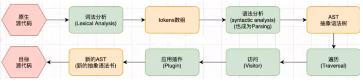

**下面就根据一段代码来分析下整个编译流程**

```javascript
// 原生代码文件
const name = 'coderwhy'
const foo = (name) => console.log(name)
foo(name)
```

- 开始词法分析，像 const name = 字符串会被一个个提取出来
- 这些词提取出来会生成 tokens 数组

```js
;[
  {
    type: 'Keyword', // 关键字
    value: 'const',
  },
  {
    type: 'Identifier', // 标识符
    value: 'foo',
  },
  {
    type: 'Punctuator', // 括号，等号，分号，逗号都叫这个
    value: '=',
  },
  {
    type: 'Punctuator',
    value: '(',
  },
  {
    type: 'Identifier',
    value: 'name',
  },
  {
    type: 'Punctuator',
    value: ')',
  },
  {
    type: 'Punctuator',
    value: '=>',
  },
  {
    type: 'Identifier',
    value: 'console',
  },
  {
    type: 'Punctuator',
    value: '.',
  },
  {
    type: 'Identifier',
    value: 'log',
  },
  {
    type: 'Punctuator',
    value: '(',
  },
  {
    type: 'Identifier',
    value: 'name',
  },
  {
    type: 'Punctuator',
    value: ')',
  },
  {
    type: 'Punctuator',
    value: ';',
  },
  {
    type: 'Identifier',
    value: 'foo',
  },
  {
    type: 'Punctuator',
    value: '(',
  },
  {
    type: 'String',
    value: '"coderwhy"',
  },
  {
    type: 'Punctuator',
    value: ')',
  },
  {
    type: 'Punctuator',
    value: ';',
  },
]
```

- 再然后就是语分析
  - 怎么分析呢？就是拿到这个 tokens 数组进行遍历
  - 判断当前的值是个“const”的话，就知道它定义个变量
  - 这个过程也叫做 Parsing
- 经过各种分析之后，就会生成 AST，抽象语法树长什么样呢？
  - 最外层有一些信息，type 存放 Program，
  - body 存放着一些代码信息，比如定义了一个 foo 标识符，初始化为箭头函数

```json
{
  "type": "Program",
  "body": [
    {
      "type": "VariableDeclaration",
      "declarations": [
        {
          "type": "VariableDeclarator",
          "id": {
            "type": "Identifier",
            "name": "foo"
          },
          "init": {
            "type": "ArrowFunctionExpression",
            "id": null,
            "params": [
              {
                "type": "Identifier",
                "name": "name"
              }
            ],
            "body": {
              "type": "CallExpression",
              "callee": {
                "type": "MemberExpression",
                "computed": false,
                "object": {
                  "type": "Identifier",
                  "name": "console"
                },
                "property": {
                  "type": "Identifier",
                  "name": "log"
                }
              },
              "arguments": [
                {
                  "type": "Identifier",
                  "name": "name"
                }
              ]
            },
            "generator": false,
            "expression": true,
            "async": false
          }
        }
      ],
      "kind": "const"
    },
    {
      "type": "ExpressionStatement",
      "expression": {
        "type": "CallExpression",
        "callee": {
          "type": "Identifier",
          "name": "foo"
        },
        "arguments": [
          {
            "type": "Literal",
            "value": "coderwhy",
            "raw": "\"coderwhy\""
          }
        ]
      }
    }
  ],
  "sourceType": "script"
}
```

- 然后就是对上面这个 AST 进行遍历，深度优先
- 去访问这个树上的每一个节点
- 然后在访问的过程中应用每一个插件对代码进行转换，对某些节点进行修改（插件就是在这个过程中被应用的）
- 访问完每一个节点并且应用插件修改完之后，就会生成一个新的 AST

```javascript
{
  "type": "Program",
  "body": [
    {
      "type": "VariableDeclaration",
      "declarations": [
        {
          "type": "VariableDeclarator",
          "id": {
            "type": "Identifier",
            "name": "foo"
          },
          "init": {
            "type": "FunctionExpression",
            "id": {
              "type": "Identifier",
              "name": "foo"
            },
            "params": [
              {
                "type": "Identifier",
                "name": "name"
              }
            ],
            "body": {
              "type": "BlockStatement",
              "body": [
                {
                  "type": "ReturnStatement",
                  "argument": {
                    "type": "CallExpression",
                    "callee": {
                      "type": "MemberExpression",
                      "computed": false,
                      "object": {
                        "type": "Identifier",
                        "name": "console"
                      },
                      "property": {
                        "type": "Identifier",
                        "name": "log"
                      }
                    },
                    "arguments": [
                      {
                        "type": "Identifier",
                        "name": "name"
                      }
                    ]
                  }
                }
              ]
            },
            "generator": false,
            "expression": false,
            "async": false
          }
        }
      ],
      "kind": "var"
    },
    {
      "type": "ExpressionStatement",
      "expression": {
        "type": "CallExpression",
        "callee": {
          "type": "Identifier",
          "name": "foo"
        },
        "arguments": [
          {
            "type": "Literal",
            "value": "coderwhy",
            "raw": "\"coderwhy\""
          }
        ]
      }
    }
  ],
  "sourceType": "script"
}
```

- 然后再根据这个新的 AST 生成 ES5 的代码

### 10 热更新

方式一： 在`packjson`中脚本添加`--watch` 使用浏览器的 live server

```javascript
"scripts": {
    "test": "echo \"Error: no test specified\" && exit 1",
    "build": "webpack --config wk.config.js --watch"
  },
```

方式二：在 webpack 配置文件中天添加：`watch:true` 使用浏览器的 live server

缺点：

- 这两个方式性能消耗大，有修改所有的源代码都会被编译。编译成功时候，都会进行文件读写。

- 不能进行局部的更新，例如就一个组件被更新了，他就会全部的更新

方式三：webpack-dev-server

安装： `npm i webpack-dev-server -D`

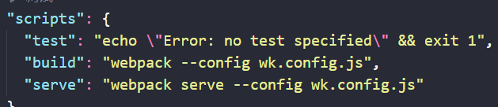

要注意的就是入口文件要是 index.js

这个插件会帮忙建立一个静态服务器

#### 10.1 模块热替换(hot module replacement)

模块热替换(HMR - hot module replacement)功能会在应用程序运行过程中，替换、添加或删除 [模块](https://webpack.docschina.org/concepts/modules/)，而无需重新加载整个页面。主要是通过以下几种方式，来显著加快开发速度：

- 保留在完全重新加载页面期间丢失的应用程序状态。
- 只更新变更内容，以节省宝贵的开发时间。
- 在源代码中 CSS/JS 产生修改时，会立刻在浏览器中进行更新，这几乎相当于在浏览器 devtools 直接更改样式。

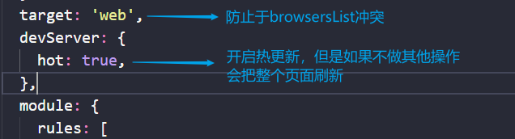

```javascript
if (module.hot) {
  module.hot.accept(['./js/title.js'])
}
```

选取要热更新的模块，就可以实现，单独的模块的更新，而不是刷新页面了。

### 11 source-map

`source map` 是将编译、打包、压缩后的代码映射回源代码的过程。打包压缩后的代码不具备良好的可读性，想要调试源码就需要 soucre map。

map 文件只要不打开开发者工具，浏览器是不会加载的。

线上环境一般有三种处理方案：

- `hidden-source-map`：借助第三方错误监控平台 Sentry 使用
- `nosources-source-map`：只会显示具体行数以及查看源代码的错误栈。安全性比 sourcemap 高
- `sourcemap`：通过 nginx 设置将 .map 文件只对白名单开放(公司内网)

注意：避免在生产中使用 `inline-` 和 `eval-`，因为它们会增加 bundle 体积大小，并降低整体性能。
